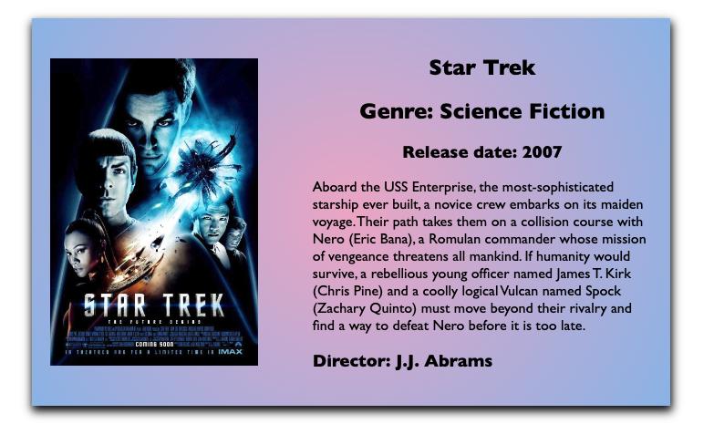

CREATE A DIFFERENT BRANCH FOR THE DIFFERENT HOMEWORK SECTIONS
USING THE MOVIES ARRAY GET THE FOLLOWING STORED IN A VARIABLE FOR 

SECTION 1. EXERCISE THE .map() method
EXAMPLE let moviesTitles = (for the first task in this section)

      1) Movie titles
      2) Movie title and description
      3) Movie title, description, genre
       TO GET THE GENRE NAME genre.name
      4) Movie title, description, genre name, director name

SECTION 2. EXERCISE THE .filter() map
EXAMPLE let adventureMovies = (for the first task in this section)

    1) Get all movies with Science Fiction genre
    2) Get all movies with Adventure genre
    3) Get all movies with Fantasy genre
    4) Get all movies that were realeased later then 2007
    5) Get all adventure genre movies that were released later then 2011

SECTION 3. LETS CREATE SOME HTML
   
    Create a list of movies and use the following design for each card. Add each card one next to another with some space between them.
    The design doesn't have to be exactly the same ( talking about the spacings, I just want to see the image on the left and the informations on the right
    
    How to create a img tag in JS and add a src value to it https://softauthor.com/javascript-working-with-images/

    font-family: 'Gill Sans', 'Gill Sans MT', Calibri, 'Trebuchet MS', sans-serif;

     background: rgb(238,174,202);
     background: radial-gradient(circle, rgba(238,174,202,1) 0%, rgba(148,187,233,1) 100%);

***BONUS Create 3 buttons to filter the movies by genre like we did on the live demo

